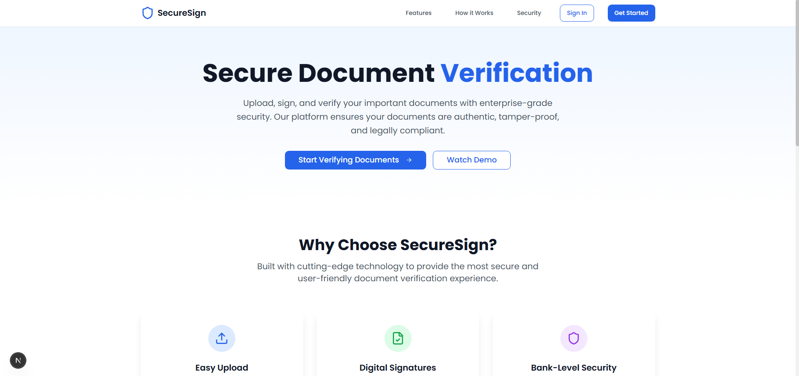
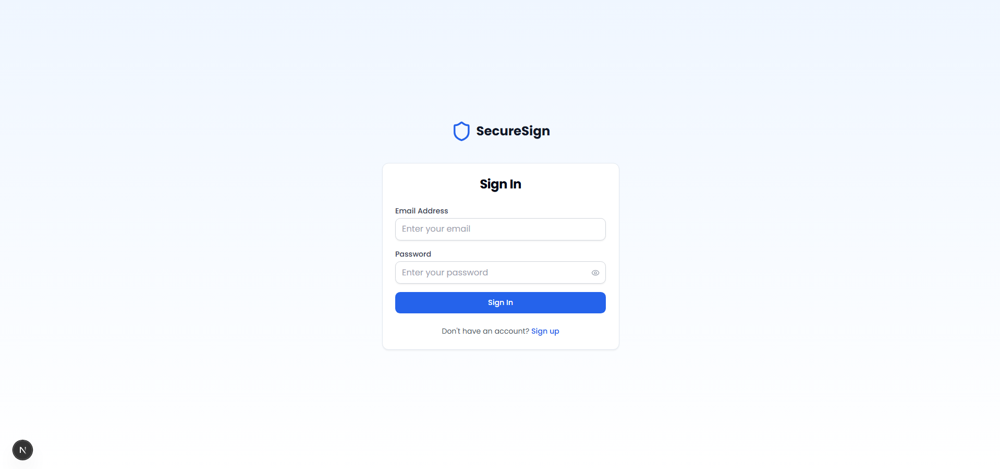
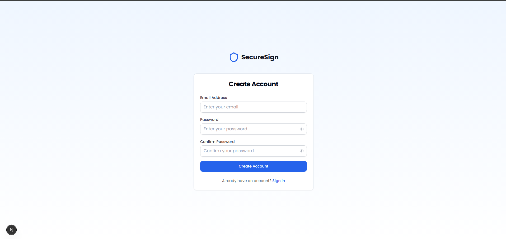
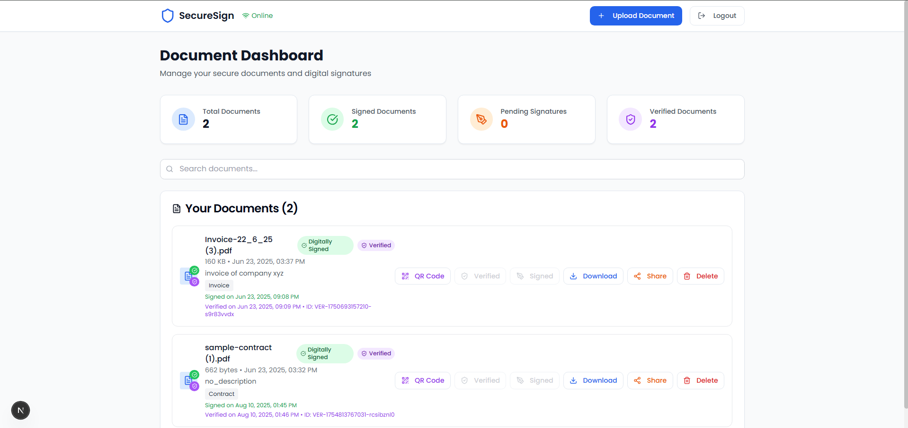

# SecureSign – Document Upload & Verification System

A secure, scalable platform for **document management and verification** powered by **ASP.NET Core** and **React/Next.js**.  
Designed for organizations that require **authenticity, integrity, and traceability** in digital documents.  

---

## Key Features
- Secure document upload, storage, and management with encryption  
- QR code generation and scanning for document verification  
- Role-based access control for users  
- Dashboard to track uploads, verifications, and activity  
- Modern stack: ASP.NET Core backend + React/Next.js frontend  

---

## Project Structure

docsupload/
│── backend/ # ASP.NET Core Web API
│── frontend/ # React/Next.js user interface
│── images/ # Project screenshots & diagrams
│── README.md

---

## Getting Started

### 1. Clone Repository
```bash
git clone https://github.com/63kb/docsupload.git
cd docsupload

cd backend
dotnet restore
dotnet run

cd frontend
npm install
npm run dev

```
# Screenshots

Below are some key screens from the SecureSign application.  

## Landing Page
The landing page provides a clean introduction to SecureSign.

### Landing Page - Hero Section



### 1. Login Page
A clean and secure login interface for users.  



---

### 2. Dashboard
An overview of uploaded documents, verification stats, and recent activity.  



## Tech Stack

-Backend: ASP.NET Core 8, Entity Framework Core, PostgreSQL

-Frontend: React.js / Next.js, TailwindCSS

-Authentication: JWT-based authentication


